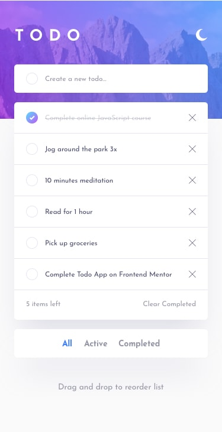

<p align="center">
    
   </p>
   
   [](https://app.netlify.com/sites/todoapp-frontend-mentor/deploys)
   
   
   
   
   ### [📖  Go to CHANGELOG.md to view the changes registry](CHANGELOG.md)
   
   
   <h1 align="center">Todo App Challenge</h1>

  
  
## The challenge

Your challenge is to build out this todo app and get it looking as close to the design as possible.

You can use any tools you like to help you complete the challenge. So if you've got something you'd like to practice, feel free to give it a go.

Your users should be able to:

- View the optimal layout for the app depending on their device's screen size
- See hover states for all interactive elements on the page
- Add new todos to the list
- Mark todos as complete
- Delete todos from the list
- Filter by all/active/complete todos
- Clear all completed todos
- Toggle light and dark mode
- **Bonus**: Drag and drop to reorder items on the list

**To do this challenge, you need a good understanding of HTML, CSS and JavaScript.**

## Desktop Design

#### Dark Theme
<div>
  
</div>

#### Light Theme
<div>
  
</div>

## Mobile Design

#### Dark Theme
<p align="center">
  
</p>

#### Light Theme
<p align="center">
  
</p>

## Demo
[https://todoapp-frontend-mentor.netlify.app/](https://todoapp-frontend-mentor.netlify.app/)

## Project
### Tools
- Vue 3 Framework
- Composition API
- Bootstrap
- CSS and SASS
- Vue Draggable Next
- Release-it

### Project Structure
The files are structured as follow:

    .
    ├── public               # Static Files
    ├── src
        ├── assets           # Project Resources.
        ├── components       # Principal Components
            ├── shared       # Base Components
            ├── todo         # Reusable Components without state.
        ├── docs             # Utilities
        ├── views            # Project Pages
    ├── CHANGELOG.md         # Document the changed of the project on `Keep and changelog` format.
    └── README.md            # The first page that the user will view when will visit the repository.


## Project setup

```
clone repository

npm install

npm run serve
```

### Compiles and minifies for production
```
npm run build
```

### CI/CD

Settings for Continuous Deployment from a Git repository on Netlify 

### Customize configuration
See [Configuration Reference](https://cli.vuejs.org/config/).
